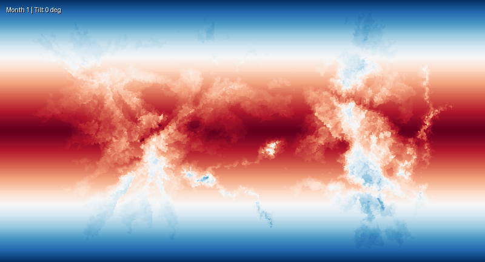
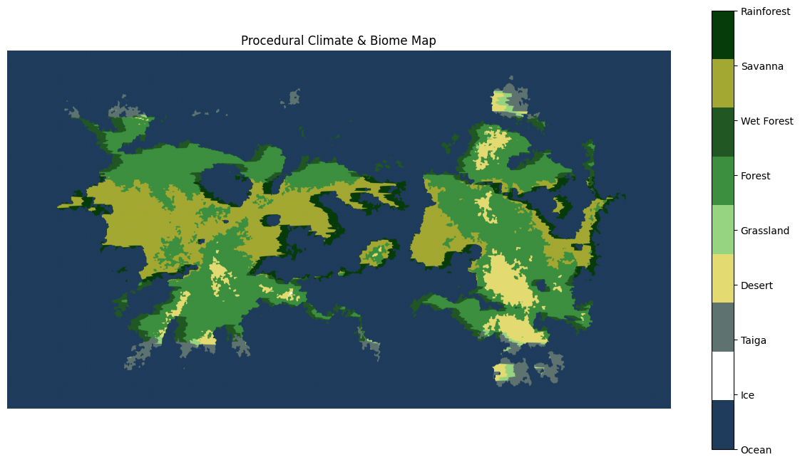
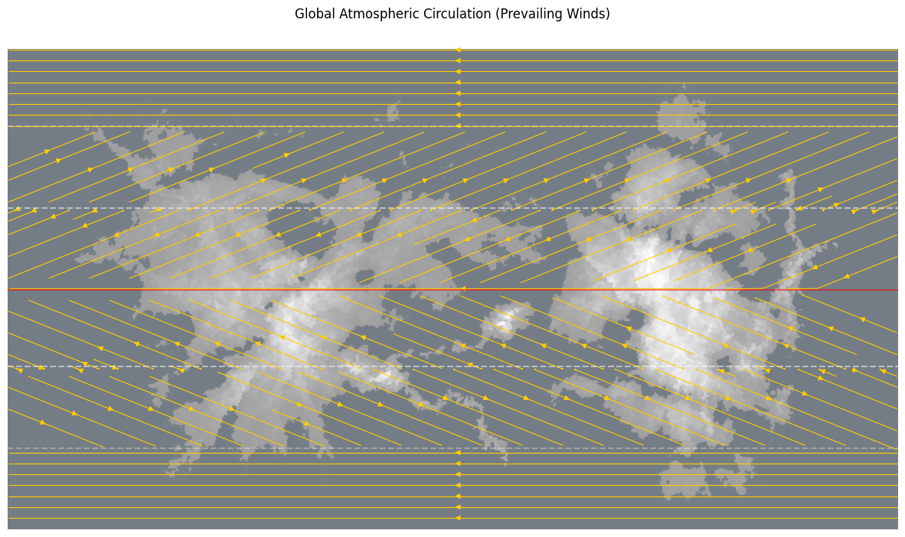
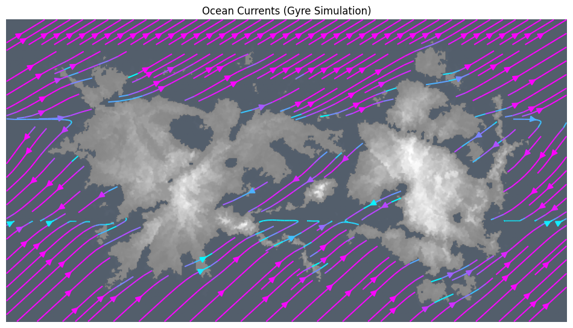

# Climate Experiment (Karneth)


A climate‑generation experiment for the planet **Karneth**.
A single grayscale heightmap (`heightmap.png`) defines the planet’s terrain, and the Jupyter notebook (`simulation.ipynb`) builds a full climate system from it.
The notebook:

1. Prepares the heightmap.
2. Calculates temperature and moisture maps.
3. Simulates prevailing winds and ocean currents.
4. Classifies biomes and visualizes results.
5. Creates animations showing seasonal temperature changes and fluid dynamics.

Run cells sequentially to see each stage.

Dependencies include:

- Python 3.10+
- numpy
- opencv-python
- matplotlib
- pillow
- ipython (for display)

Install via:

```bash
pip install numpy opencv-python matplotlib pillow ipython
```

## Results

### Wind and Ocean Currents Particle Simulation


### Average Planet Temperature



### Climate/Biome



### Atmospheric Circulations



### Ocean Currents


